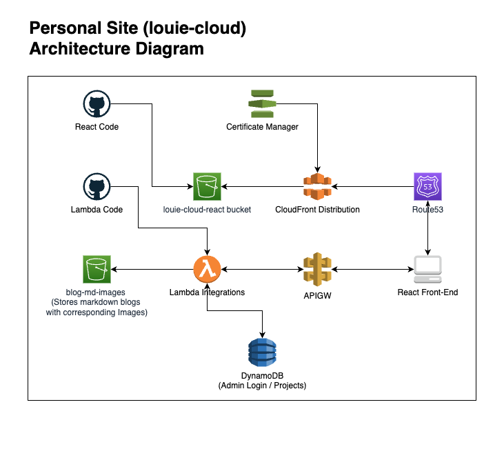

# louie.cloud-react Repository
The React FE code for louie.cloud. Includes Github workflow for pushing code directly to s3 bucket where static site is hosted.

# Architecture Diagram

## Other bits of code that are used by this repository:
- [api.louie.cloud](https://github.com/leormston/api.louie.cloud) - Code used to populate lambda that is used when api for louie.cloud is called.
- [email-me-lambda](https://github.com/leormston/email-me-lambda) - Lambda code for endpoint that sends an email given a body, sender, name and subject.